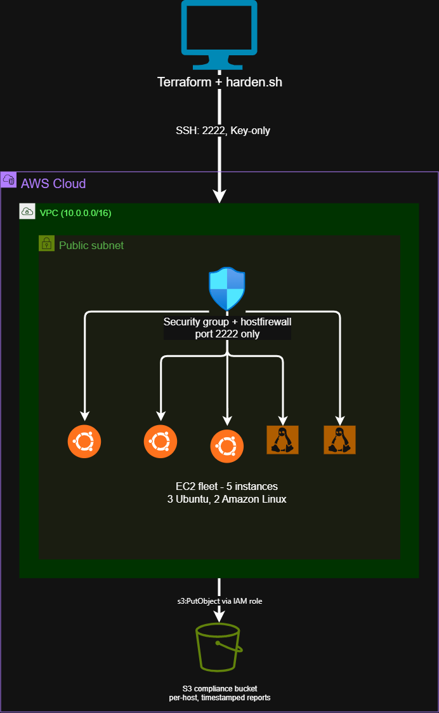

# Automated OS Hardening & Security Audit

Terraform-provisioned, cross-distro EC2 fleet hardened by a bash toolchain, with per-host compliance reports pushed to S3. Built to demonstrate infrastructure-as-code, Linux security fundamentals, and least-privilege IAM design end to end.

> Full technical walkthrough (screenshots, command-by-command breakdown, and design rationale) is in [docs/index.md](docs/index.md).

## What this does

- Provisions a 5-instance fleet (3 Ubuntu 22.04, 2 Amazon Linux 2023) via modular Terraform, with remote state locked in S3 + DynamoDB
- Hardens each instance via a single idempotent bash script:
  - Disables root SSH login and password authentication (key-only access)
  - Migrates SSH off port 22 to a custom port, using a verified two-stage cutover to avoid lockout
  - Configures a host-level firewall (UFW on Ubuntu, firewalld on Amazon Linux), independent of the AWS security group
  - Enables automatic security patching (`unattended-upgrades` / `dnf-automatic`)
- Generates a per-host markdown compliance report and uploads it to a dedicated, access-locked S3 bucket via a scoped IAM instance role - no credentials stored on any host

## Architecture

A single VPC and public subnet host the fleet. Inbound access is restricted to one trusted IP on the hardened SSH port only, enforced redundantly at the security group, the host firewall, and the SSH daemon itself. Each instance assumes an IAM role (via instance profile) to write its own report to S3 - no static AWS credentials exist anywhere in the codebase.



## Stack

Terraform · AWS (EC2, VPC, IAM, S3, DynamoDB) · Bash · UFW / firewalld

## Repo structure

```
terraform/
  modules/
    network/            VPC, subnet, IGW, routing
    security-group/     SSH-only ingress, scoped to a trusted IP
    ec2-fleet/          5-instance fleet via for_each, key pair generation
    compliance-bucket/  S3 bucket + least-privilege IAM role/instance profile
scripts/
  harden.sh             Master hardening script (SSH, port, firewall, patching)
  generate_report.sh    Compliance check + markdown report + S3 upload
  lib/distro.sh         OS detection helper (Ubuntu vs Amazon Linux)
iam-setup/
  project2-iam-policy.json  Scoped IAM policy for the automation user
docs/
  index.md              GitHub Pages walkthrough with screenshots
  assets/               Screenshots and architecture image
```

## Running it

Requires an AWS account, Terraform >= 1.10, and the AWS CLI.

```bash
cd terraform
terraform init
terraform apply          # trusted_ip_cidr must allow port 22 for initial access

# for each instance
scp -i <key>.pem -r scripts <user>@<ip>:/home/<user>/
ssh -i <key>.pem <user>@<ip> "cd scripts && ./harden.sh"

# after verifying access on the hardened port
ssh -i <key>.pem -p <hardened_port> <user>@<ip>
source harden.sh && remove_legacy_ssh_port

./generate_report.sh     # run per instance, uploads to S3
```

Once every instance is confirmed reachable only on the hardened port, remove the temporary port-22 rule from the security group.

## Design notes

- **Least-privilege IAM throughout** - the automation user's own policy is scoped to `project2-*` named resources only; the EC2 instance role can only `PutObject` to its one bucket.
- **Two-stage SSH port migration** - the new port is added and verified before the old one is removed, so a misconfiguration cannot cause a full lockout.
- **Defense in depth** - port 22 is closed independently at three layers (security group, host firewall, sshd config), not relied on as a single point of enforcement.
- **Idempotent by design** - every hardening step checks current state before acting, so the script is safe to re-run against an already-hardened host.

## Known limitations

- SSH access is gated by a manually maintained trusted-IP allowlist. In production this would be replaced with AWS Systems Manager Session Manager, removing the need for any open inbound SSH port.
- No Elastic IPs - instance public IPs are not fixed across stop/start cycles.
